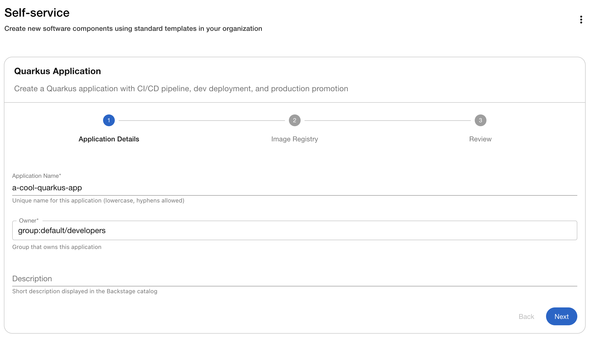
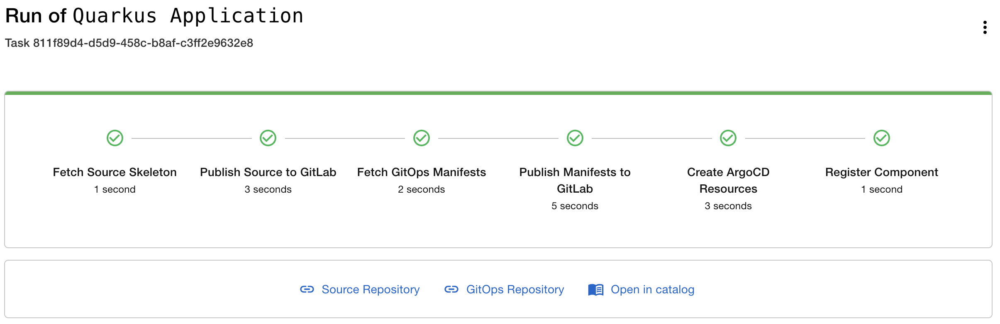
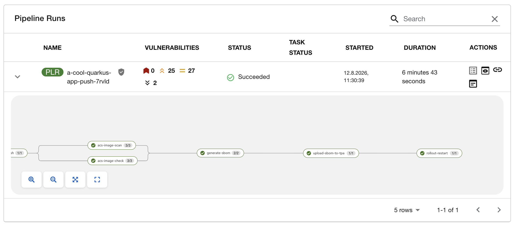
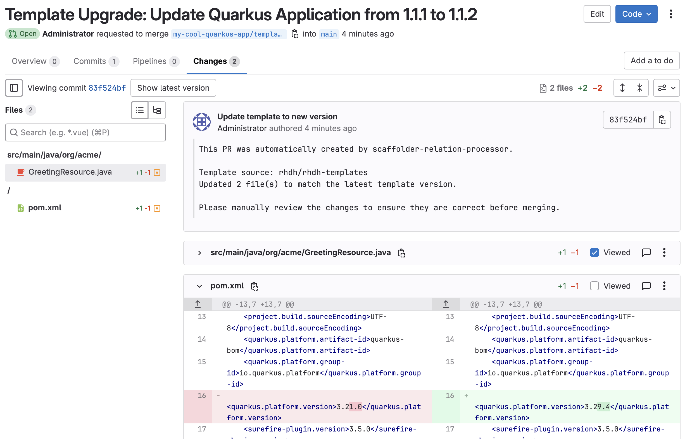
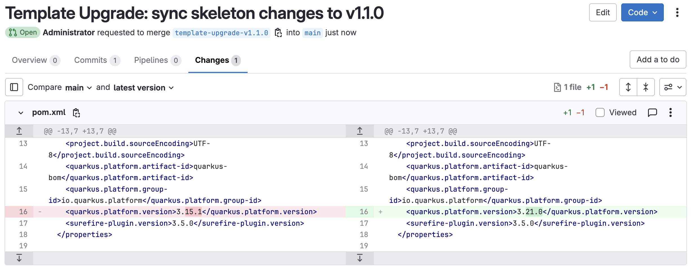

# Automated Software Template Lifecycle Management

Demonstrate how a platform team can maintain compliance and consistency across all applications created from a Software Template in Red Hat Developer Hub (RHDH). When the template skeleton changes, those changes are automatically proposed as GitLab merge requests to every downstream repository.

## Demo environment for Red Hatters

Setup from Demo catalog: [OpenShift Advanced App Platform Demo](https://catalog.demo.redhat.com/catalog/babylon-catalog-prod?item=babylon-catalog-prod/published.ocp4-adv-app-platform-demo.prod)

## Overview

A platform engineer publishes a Quarkus Software Template. Developers create applications from it through the RHDH self-service catalog. Later, the platform engineer updates the skeleton (e.g. a Quarkus version upgrade for a security patch or new features). The `scaffolder-relation-processor` plugin detects the version bump, compares the skeleton against every downstream repo, and opens a merge request with the differences.

```
Platform Engineer                            Developer
      |                                          |
      |  1. Push template + enable lifecycle     |
      |                                          |
      |                              2. Create app from template
      |                              3. Pipeline runs, app deploys
      |                              4. Develop (push, iterate)
      |                                          |
      |  5. Update skeleton, bump version        |
      |  6. Push updated template                |
      |                                          |
      |                              7. MR appears in app repo
      |                              8. Review and merge
```

## How it works

Two fields wire up the lifecycle tracking:

`template.yaml` carries a version annotation:

```yaml
metadata:
  annotations:
    backstage.io/template-version: "1.0.0"
```

`skeleton/catalog-info.yaml` links each created entity back to its source template:

```yaml
spec:
  scaffoldedFrom: template:default/quarkus-app
```

When the template version changes, the `scaffolder-relation-processor` plugin:

1. Finds all catalog entities whose `spec.scaffoldedFrom` references this template
2. Resolves each entity's source repository via the `backstage.io/managed-by-location` annotation (set automatically by the `catalog:register` step)
3. Compares the current skeleton files against the repo contents
4. Creates a GitLab merge request with additions, modifications, and deletions

---

## Part 1 — Infrastructure Setup

### Prerequisites

- `oc` CLI logged in to the OpenShift cluster as admin
- The cluster has been provisioned with RHDH, GitLab CE, OpenShift Pipelines (Tekton), and OpenShift GitOps (ArgoCD)
- The `rhdh/rhdh-templates` GitLab repo exists (created by the cluster bootstrap)
- `python3` and `curl` available locally

### 1. Push the template to GitLab

The script auto-detects cluster-specific values from the OpenShift API and replaces the `__PLACEHOLDER__` markers in the template files before committing them to GitLab.

```bash
./scripts/push-template.sh              # auto-detect everything
./scripts/push-template.sh --dry-run    # preview without pushing
```

What the script does:

- Reads the cluster subdomain from `oc get ingresses.config.openshift.io cluster`
- Retrieves the GitLab root token from the `root-user-personal-token` secret
- Disables GitLab Auto DevOps at the instance level
- Replaces placeholders and commits all template files via the GitLab Commits API
- Registers the template in the root `catalog-info.yaml` if not already present

Override auto-detected values if needed:

```bash
GITLAB_HOST=my-gitlab.example.com \
CLUSTER_SUBDOMAIN=apps.my-cluster.example.com \
QUAY_HOST=quay.my-cluster.example.com \
GITOPS_NAMESPACE=rhdh-gitops \
GITLAB_TOKEN=glpat-xxxxxxxxxxxx \
./scripts/push-template.sh
```

| Variable            | Default (auto-detected)                                      |
| ------------------- | ------------------------------------------------------------ |
| `CLUSTER_SUBDOMAIN` | From `oc get ingresses.config.openshift.io cluster`          |
| `GITLAB_HOST`       | `gitlab-gitlab.<CLUSTER_SUBDOMAIN>`                          |
| `QUAY_HOST`         | `quay.<CLUSTER_SUBDOMAIN>`                                   |
| `GITOPS_NAMESPACE`  | `rhdh-gitops`                                                |
| `GITLAB_TOKEN`      | From `root-user-personal-token` secret in `gitlab` namespace |

### 2. Enable automated template lifecycle management

```bash
./scripts/enable-template-lifecycle.sh              # configure RHDH
./scripts/enable-template-lifecycle.sh --dry-run     # preview changes
```

The script configures three things on the cluster:

1. **Enables the plugin** — adds `backstage-community-plugin-catalog-backend-module-scaffolder-relation-processor-dynamic` (bundled but disabled by default) to the `dynamic-plugins` ConfigMap
2. **Enables PR creation and notifications** — adds the following to the `app-config-rhdh` ConfigMap:
  ```yaml
   scaffolder:
     pullRequests:
       templateUpdate:
         enabled: true
     notifications:
       templateUpdate:
         enabled: true
  ```
3. **Prevents ArgoCD from reverting the changes** — if RHDH is managed by an ArgoCD Application, the script adds `ignoreDifferences` entries for both ConfigMaps so GitOps sync doesn't overwrite them
4. **Restarts RHDH** and verifies the plugin loaded

| Variable           | Default                     |
| ------------------ | --------------------------- |
| `RHDH_NAMESPACE`   | `rhdh`                      |
| `ARGOCD_APP_NAME`  | `developer-hub-application` |
| `ARGOCD_NAMESPACE` | `openshift-gitops`          |

### 3. Verify in Developer Hub

Open RHDH at `https://backstage-developer-hub-rhdh.<CLUSTER_SUBDOMAIN>` and navigate to **Create** in the sidebar. The "Quarkus Application" template should appear after the catalog refreshes (~5 minutes).

---

## Part 2 — Demo Walkthrough

### Step 1: Create an application from the template

1. Open Developer Hub and go to **Create**
2. Select the **Quarkus Application** template
3. Fill in:
  - **Application Name**: e.g. `my-quarkus-app`
  - **Owner**: select a group from the catalog
  - **Image Organization**: leave as `parasol` (or your Quay org)
4. Click **Create**



The template scaffolds two GitLab repositories and bootstraps ArgoCD:

| What             | Where                           |
| ---------------- | ------------------------------- |
| Source code      | `parasol/my-quarkus-app`        |
| GitOps manifests | `parasol/my-quarkus-app-gitops` |
| ArgoCD apps      | `rhdh-gitops` namespace         |



### Step 2: Trigger the first pipeline run

The GitLab webhook that feeds the Tekton pipeline is registered by a job that runs *after* ArgoCD syncs the build chart, which happens *after* the scaffolder has already pushed the skeleton's initial commit. That means the very first push isn't seen by the webhook — you need to make a small change and commit it to the source repo (`parasol/my-quarkus-app`) to trigger the first pipeline run:

```bash
git clone https://<gitlab-host>/parasol/my-quarkus-app.git
cd my-quarkus-app
git commit --allow-empty -m "Trigger initial pipeline run"
git push
```

This kicks off:

```
git-clone -> maven-build -> buildah build+push -> ACS scan -> SBOM generation -> rollout-restart
```

Check progress in Developer Hub under the component's **CI** tab (Tekton plugin), or directly:

```bash
oc get pipelineruns -n my-quarkus-app-build
```



Once the pipeline completes, ArgoCD deploys the app to the dev namespace:

```bash
oc get pods -n my-quarkus-app-dev
curl https://my-quarkus-app-my-quarkus-app-dev.<CLUSTER_SUBDOMAIN>/
# Hello from Quarkus!
```

### Step 3: Verify lifecycle tracking is wired up

Confirm the scaffolded app's `catalog-info.yaml` in GitLab (`parasol/my-quarkus-app`) contains:

```yaml
spec:
  scaffoldedFrom: template:default/quarkus-app
```

In Developer Hub, the component's relations should show a `scaffoldedFrom` link back to the template.

### Step 4: Update the template skeleton

Suppose a new Quarkus version is available with security fixes and all applications must be upgraded. Update the Quarkus platform version in `pom.xml` in the skeleton:

```xml
<!-- was: 3.15.1 -->
<quarkus.platform.version>3.21.0</quarkus.platform.version>
```

Then bump the template version in `templates/quarkus-app/template.yaml`:

```yaml
metadata:
  annotations:
    backstage.io/template-version: "1.1.0"  # was "1.0.0"
```

### Step 5: Push the updated template

```bash
./scripts/push-template.sh
```

### Step 6: Check for the merge request

Wait ~5 minutes for the RHDH catalog to refresh and the plugin to detect the version change. Then check GitLab for a merge request in `parasol/my-quarkus-app` named something like:

```
my-quarkus-app/template-upgrade-v1.1.0
```



The MR contains the diff between the old and new skeleton files — in this case, the Quarkus version change in `pom.xml`. Review it and merge to apply the update.

If notifications are enabled, the entity owner also receives a notification in Developer Hub with a link to the MR.

### Caveats

- The sync engine uses regex matching for template variables (`${{ values.name }}`). Variables that don't match keys in the scaffolded repo remain in raw template syntax. **Always review the generated MRs before merging.**
- Conditional Jinja2 blocks (``) are stripped, which might cause unexpected formatting.
- If the entity owner is a Group (not a User), the MR is created without an assigned reviewer.
- The `notifications` plugin must be enabled for notifications to work (it is enabled by default on clusters provisioned with the orchestrator).

### Troubleshooting: no merge request appears

Work through these in order — each one rules out a layer.

**1. Is the plugin actually loaded?**

Enabling the plugin (`./scripts/enable-template-lifecycle.sh`) only guarantees a ConfigMap looks correct, not that the running pod picked it up. Confirm it's really loaded:

```bash
oc logs deploy/backstage-developer-hub -n rhdh -c backstage-backend | grep "loaded dynamic backend plugin.*relation-processor"
```

If nothing prints, the ConfigMap write may have been silently reverted (e.g. by an ArgoCD sync missing `ignoreDifferences`) or never applied. Re-run the enable script — it verifies this itself and now fails loudly instead of printing a false "configured!" banner.

**2. Ignore the `events backend not found` warning in the logs**

Right after the plugin loads, you'll likely see:

```
Event subscribe request failed with status 404, events backend not found. Will only receive events that were sent locally on this process.
```

This looks alarming but is expected and harmless in this setup: the plugin falls back to in-process event delivery, which is all it needs since the publisher (catalog processor) and subscriber (notification/PR handler) run in the same backend process. This is **not** the cause of a missing MR — don't spend time chasing it.

**3. The real gotcha: the plugin must observe the version change live**

The plugin only creates an MR when it sees a template's `backstage.io/template-version` *increase from a version it previously cached*. That cache is seeded the first time the plugin processes the template entity — if you bump the version and push it *before* enabling the plugin (or before restarting RHDH after enabling it), the plugin's first pass just records the new version as its baseline. No prior value to compare against means no change is detected, so **no MR is created for that transition, silently.**

If you enabled lifecycle management after a version bump was already pushed and no MR shows up after waiting for a catalog refresh (~5 minutes), bump the version once more (e.g. `1.1.0` → `1.1.1`) and push again with `./scripts/push-template.sh`. Now that the plugin has a cached baseline, this transition will be observed live and should trigger the MR.

**4. Still nothing after a live version bump?**

Check for the plugin actually receiving the event and attempting the diff:

```bash
oc logs deploy/backstage-developer-hub -n rhdh -c backstage-backend --since=10m | grep -i "template update event\|scaffolder-relation-processor"
```

If you see `Received template update event for ...` but still no MR, the failure is downstream (GitLab token permissions, VCS integration config, or the `backstage.io/managed-by-location` annotation not being a `url:`-type location) — check the plugin's own troubleshooting notes for those cases.

---

## Part 3 — Alternative: Scoped Diff Propagation

The `scaffolder-relation-processor` plugin always fetches the **current** skeleton and the **current** state of each downstream repo and diffs those directly (confirmed in its [Template Update PRs docs](https://github.com/backstage/community-plugins/blob/main/workspaces/scaffolder-relation-processor/plugins/catalog-backend-module-scaffolder-relation-processor/docs/templateUpdatePRs.md) — there's no config option to narrow this). In practice, a project makes plenty of its own changes to skeleton-tracked files, and every one of them shows up in the MR alongside the actual update, which makes the MR noisy and risky to merge without a careful manual review of every hunk.

`propagate-skeleton-diff.sh` takes a different approach, closer to how tools like `cruft`/`copier update` sync templates: it diffs the last two commits `push-template.sh` already pushed to `rhdh/rhdh-templates` in GitLab (via GitLab's compare API, scoped to `templates/quarkus-app/skeleton`) and tries to apply exactly that patch to each downstream repo. A repo is only touched if the patch applies cleanly; otherwise it's skipped and reported so the platform engineer can merge it by hand. This keeps the MR scoped to what actually changed in the template — e.g. just the `quarkus.platform.version` bump — regardless of what else a project has customized.

GitLab's already-pushed history is used as the source of truth rather than local git tags in this repo. `push-template.sh` pushes straight from whatever is on disk, so a local tag would silently point at the wrong commit if you forgot to `git commit` your skeleton edits first — GitLab's history can't drift like that, since every `push-template.sh` run creates exactly one real commit there.

### Trade-offs

- Downstream repos are found by querying the RHDH catalog for `scaffoldedFrom` relations, so the relation-processor plugin (and `catalog:register`) must still be enabled — only its own PR creation is turned off.
- No template-variable resolution is attempted; the raw skeleton diff is applied as-is. This works well for simple changes like a version bump, but a patch that touches a line containing `${{ values.* }}` in the skeleton is unlikely to apply cleanly against the substituted downstream file, and that repo will just be reported as skipped rather than silently corrupted.
- Needs at least two `push-template.sh` runs in `rhdh/rhdh-templates`' history to have anything to diff — see Step 2 below.

### Step 1: Disable the plugin's automatic full-diff MRs

```bash
./scripts/disable-automated-lifecycle.sh              # apply
./scripts/disable-automated-lifecycle.sh --dry-run     # preview
```

This flips `scaffolder.pullRequests.templateUpdate.enabled` to `false` in `app-config-rhdh` and restarts RHDH. The relation-processor plugin itself and notifications are left enabled.

### Step 2: Re-run the tutorial workflow

Repeat the [Part 2 walkthrough](#part-2--demo-walkthrough) end to end — as a developer, create a fresh app from the template (Step 1) and get its first pipeline run going (Step 2); as a platform engineer, bump the Quarkus version in the skeleton and the `template.yaml` version annotation (Step 4), then push it:

```bash
./scripts/push-template.sh
```

The very first version you ever push has nothing to diff against yet, so this alternative only kicks in from the second version onward. If you're starting fresh, push once at the original version, then bump and push again before continuing.

### Step 3: Propagate the scoped diff

```bash
./scripts/propagate-skeleton-diff.sh                            # diff the last two pushed commits, open MRs
./scripts/propagate-skeleton-diff.sh --dry-run                  # show the diff and which repos would get a clean patch, without pushing anything
./scripts/propagate-skeleton-diff.sh --from-sha <sha> --to-sha <sha>   # override which two commits to diff
```

Instead of waiting ~5 minutes for the plugin's catalog-driven detection, this runs on demand. It prints the scoped file diff, finds every repo scaffolded from `template:default/quarkus-app` via the RHDH catalog, and opens a merge request per repo where the patch applies cleanly — containing only the version bump, not a full-repo comparison.



Real Backstage/RHDH backends enforce auth on the catalog API by default, so an unauthenticated call gets a `401 AuthenticationError: Missing credentials`. If `RHDH_TOKEN` isn't set, the script first tries Backstage's guest auth provider (`POST /api/auth/guest/refresh`) to get a short-lived token — this works out of the box on clusters where guest auth is enabled. On clusters where sign-in goes through OIDC/Keycloak instead (no guest auth), that attempt returns 404 and you need to set `RHDH_TOKEN` yourself.

The most reliable source for that token is a static service-to-service token RHDH already has configured — check `app-config-rhdh` for a `backend.auth.externalAccess` entry (e.g. `subject: api-clients`) and find the Secret backing its `token` env var:

```bash
oc get deploy backstage-developer-hub -n rhdh -o json \
  | python3 -c "
import json, sys
d = json.load(sys.stdin)
for c in d['spec']['template']['spec']['containers']:
    for ef in c.get('envFrom', []):
        print(c['name'], ef.get('secretRef', {}).get('name'))
"
```

Once you know which Secret and key back it (e.g. `backend-secret` / `BACKEND_SECRET`):

```bash
export RHDH_TOKEN=$(oc get secret backend-secret -n rhdh -o jsonpath='{.data.BACKEND_SECRET}' | base64 -d)
./scripts/propagate-skeleton-diff.sh
```

This authenticates as a service identity rather than a specific human user, which is the right fit for an automated script. Note that authenticating successfully doesn't guarantee authorization — if RHDH's permission framework/RBAC plugin restricts what that subject can read, you'd still see a 401/403 and would need to check the RBAC policy next.

### From script to production plugin

This script is a stand-in for a demo — the shell/`oc`/manual-token plumbing doesn't belong in a real platform. But the *logic* (diff two versions via the VCS compare API scoped to the skeleton path, find `scaffoldedFrom` entities via the catalog, `git apply` per repo, open an MR where it applies cleanly) maps directly onto Backstage backend plugin primitives, largely the same ones `scaffolder-relation-processor` already uses:

- The template-version-change trigger already exists as an in-process event in that plugin — a production version would hook into the same trigger instead of being run by hand.
- Backstage's `ScmIntegrations` gives authenticated GitHub/GitLab clients for free, replacing the manual `GITLAB_TOKEN`/`oc get secret` dance.
- The in-process catalog client replaces the external `RHDH_TOKEN` + HTTP call to `/api/catalog/entities`.

The cleanest production path is arguably not a brand-new plugin at all, but a `diffMode: scoped` (or similar) config option contributed upstream to `scaffolder-relation-processor` — the surrounding plumbing (detection, catalog lookup, PR/MR creation, reviewer assignment, notifications) is already correct; only the full-repo-vs-scoped-version diff strategy needs to become a choice instead of the only option.
